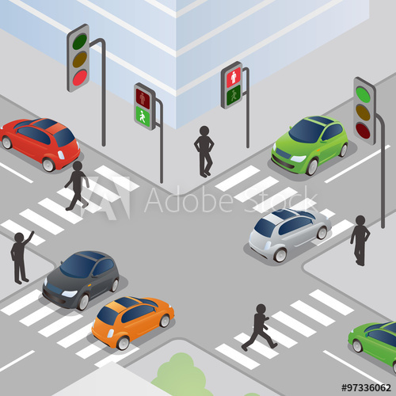

# Traffic Light Controller
This project aims to design a digital controller to control traffic at an intersection.
At each intersection, there are four traffic lights in red, yellow and green, and 
eight pedestrian lights in green and red, which naturally are the same for two-by-two vehicles 
and the four-by-four pedestrian lights also act the same.

# Behavior

1. The pedestrian light is red when the car light is green or yellow, and green when the car light is red.

2. The traffic light is green for  15 seconds by default and yellow for 4 seconds. 
Obviously, for the same cycle of the two sides, the red time of the cars is equal to the sum of the green and yellow.

3. Police Interrupt Button: 
This button is available for both directions on the street and by turning it on any side 
that has the green light will change to yellow immediately.

4. Pedestrian Interrupt Button: 
This button is also present on each side of the street.If the pedestrian lights are green 
and the remaining time is less than 3 seconds to reset, turning on this button will return 
this time to 3 seconds. Of course, pedestrians can only do this twice at a time.

5. The status of all lights will be defined according to the interruptions that have occurred.

6. Interrupts are synchronized with the clock.

7. On each side of the street, smart cameras are installed that can measure the traffic on each side
and give our control module a number. A low value indicates smoother traffic and higher value indicates heavier traffic. The intersection timetable changes based on two numbers, each corresponding to a street.

8. We have a memory where the data from the cameras is stored.

Dependencies
============
## macOS
This project needs [Icarus-Verilog](http://iverilog.icarus.com) and a VCD viewer.

## Building on macOS
1. Icarus-Verilog can be installed via Homebrew :
   <code>$ brew install icarus-verilog</code>
2. Download [Scansion](http://www.logicpoet.com/scansion/) from here.  
3. Clone the repository.
4. Change the directory to src.
3. <code>$make check</code>- compiles the verilog design - good for checking code.
4. <code>$make simulate</code> - compiles design+TB & simulates the verilog design.
5. <code>$make display</code> - displays waveforms.

